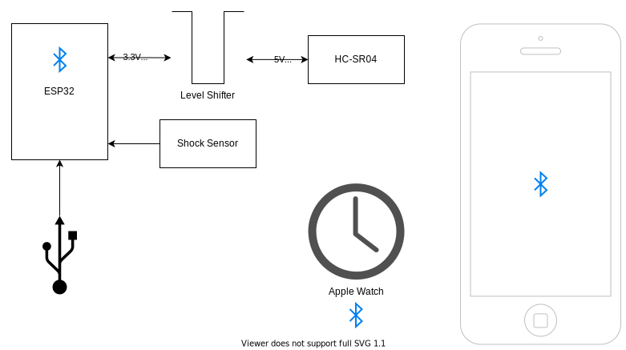

# Lepakkomaski
Sulautetun järjestelmän ohjelmointi ja mikrokontrollerit - Harjoitustyö

### Koodit:

#### ESP32
`Lepakkomaski-v1/Lepakkomaski_ESP32_BLE/Lepakkomaski_ESP32_BLE.ino` 
### iPhone
`Lepakkomaski-v1/Lepakkomaski-v1/BLEClass.swift` (Bluetooth) 
`Lepakkomaski-v1/Lepakkomaski-v1/LepakkomaskiView.swift` (UI) 
### Apple Watch
`Lepakkomaski-v1/Lepakkomaski-v1 WatchKit Extension/ContentView.swift` (UI) 

<strong>Block diagram</strong>:

## License

This project is open-sourced software licensed under the [MIT license](https://opensource.org/licenses/MIT).

